

[comment]: 

**UNIVERSIDAD PRIVADA DE TACNA**  
**FACULTAD DE INGENIERIA**  
**Escuela Profesional de Ingeniería de Sistemas**  

**Proyecto DocuCode-AI**  
Curso: *PATRONES DE SOFTWARE*  
Docente: *PATRICK JOSE CUADROS QUIROGA*  

**Integrantes:**  
Jose Luis Jarro Cachi - 2020067148  
Farley Rodrigo Eduardo Viveros Blanco - 2020066896  
Ronal Daniel Lupaca Mamani - 202006146  

**Tacna – Perú**  
**2025**

---

# CONTROL DE VERSIONES

| Versión | Hecha por | Revisada por | Aprobada por | Fecha       | Motivo              |
|---------|-----------|--------------|--------------|-------------|---------------------|
| 1.0     | MPV       | ELV          | ARV          | 3/04/2025   | Versión Original    |
| 2.0     | MPV       | ELV          | ARV          | 30/05/2020  | Mejora              |

---

# Sistema DocuCode-AI  
## Documento de Especificación de Requerimientos de Software  
**Versión 2.0**

---

# INDICE GENERAL

- [INTRODUCCION](#introduccion)
- [I. Generalidades de la Empresa](#generalidades-de-la-empresa)
- [II. Visionamiento de la Empresa](#visionamiento-de-la-empresa)
- [III. Análisis de Procesos](#análisis-de-procesos)
- [IV. Especificación de Requerimientos de Software](#especificacion-de-requerimientos-de-software)
- [V. Fase de Desarrollo](#fase-de-desarrollo)
- [CONCLUSIONES](#conclusiones)
- [RECOMENDACIONES](#recomendaciones)
- [BIBLIOGRAFIA](#bibliografia)
- [WEBGRAFIA](#webgrafia)

---

# INTRODUCCIÓN

DocuCode-AI es un sistema web basado en Inteligencia Artificial, orientado a facilitar el análisis, documentación y evaluación del código fuente para uso académico. Este sistema está dirigido principalmente a docentes y estudiantes universitarios, brindando funcionalidades como generación automática de comentarios en código, elaboración de diagramas UML, análisis de calidad y detección de duplicados. El desarrollo del sistema se enmarca dentro de la asignatura de Patrones de Software y forma parte del proyecto académico correspondiente a la primera unidad.

# I. Generalidades de la Empresa

## 1. Nombre de la Empresa

DocuCode-AI

## 2. Visión

Ser una plataforma líder a nivel académico en la generación automatizada de documentación de código y evaluación inteligente de software, contribuyendo a mejorar la enseñanza y aprendizaje en el área de programación.

## 3. Misión

Desarrollar una solución web basada en inteligencia artificial que permita a los docentes y estudiantes analizar, documentar y entender código fuente de manera rápida, precisa y estructurada, promoviendo buenas prácticas de desarrollo y facilitando la revisión académica.

## 4. Organigrama

*No se especifica en el documento.*

# II. Visionamiento de la Empresa

## 1. Descripción del Problema

En el contexto educativo universitario, la revisión y comprensión del código fuente entregado por los estudiantes representa un desafío constante para los docentes. La falta de documentación, la presencia de código duplicado o mal estructurado, y el escaso uso de buenas prácticas de programación dificultan una evaluación objetiva, ágil y formativa.

Esta problemática se agudiza cuando los cursos están orientados a proyectos prácticos, y los tiempos de revisión son limitados. Actualmente, la revisión del código se realiza de forma manual, lo cual genera demoras, evaluaciones subjetivas y una carga de trabajo innecesaria.

## 2. Objetivos de Negocios

El proyecto DocuCode-AI busca resolver esta problemática mediante una solución tecnológica que ofrezca beneficios tangibles al ámbito educativo:

- Reducir el tiempo de revisión del código por parte de los docentes.
- Mejorar la calidad del aprendizaje práctico en programación.
- Aumentar la objetividad en la evaluación de trabajos entregados.
- Promover buenas prácticas de desarrollo desde etapas tempranas.
- Integrar herramientas de inteligencia artificial en el proceso educativo.
- Posicionar a la institución como promotora de la innovación académica.

## 3. Objetivos de Diseño

Los objetivos de diseño del sistema están orientados a la creación de una plataforma funcional, accesible y escalable que cumpla con los siguientes principios:

- **Modularidad:** Separar responsabilidades en componentes reutilizables (Frontend, Backend, Motor de IA, Evaluador de código).
- **Usabilidad:** Interfaz clara e intuitiva para docentes y estudiantes.
- **Portabilidad:** Accesible desde cualquier navegador moderno sin necesidad de instalaciones.
- **Escalabilidad:** Capacidad para integrar nuevas funciones como generación de informes PDF, revisión colaborativa, entre otros.
- **Seguridad:** Control de acceso por autenticación con cuentas de Google y almacenamiento privado de historiales por usuario.

## 4. Alcance del Proyecto

El alcance del proyecto DocuCode-AI comprende el diseño, desarrollo e implementación de un sistema web con las siguientes funcionalidades:

- Subida de archivos de código o archivos comprimidos (ZIP/RAR).
- Análisis automático del código utilizando un motor basado en inteligencia artificial.
- Generación de comentarios explicativos en el código fuente.
- Creación automática de diagramas UML (Clases, Casos de Uso, Secuencia, Actividades, Paquetes y Componentes).
- Evaluación de la calidad del código (métricas básicas, organización, claridad).
- Detección de código duplicado.
- Registro e inicio de sesión de usuarios mediante Google OAuth.
- Historial individual de análisis por usuario.
- Interfaz web responsive.

## 5. Viabilidad del Sistema

DocuCode-AI ha demostrado ser técnicamente y económicamente viable en función de los siguientes aspectos:

- **Factibilidad técnica:** Se utilizarán tecnologías disponibles y conocidas por el equipo (PHP, Python, OpenAI API, MySQL), que permiten la implementación modular y efectiva del sistema.
- **Factibilidad operativa:** El sistema puede ser fácilmente adoptado por docentes con conocimientos básicos de navegación web. No requiere capacitación extensa.
- **Factibilidad económica:** El análisis costo-beneficio y la TIR reflejan una inversión inicial baja con beneficios significativos en tiempo ahorrado y mejora educativa.
- **Factibilidad académica:** El sistema responde a una necesidad real en el contexto universitario y se alinea con los objetivos del curso de Patrones de Software.

## 6. Información Obtenida del Levantamiento de Información

Para definir adecuadamente los requerimientos del sistema, se realizaron las siguientes actividades de levantamiento de información:

- Entrevistas informales con docentes de programación de la Universidad Privada de Tacna, quienes manifestaron dificultades para evaluar códigos desorganizados o sin documentación.
- Observación directa de trabajos entregados por estudiantes en semestres previos, los cuales carecían de claridad, comentarios y estructura adecuada.
- Análisis de tendencias en herramientas de documentación automática y evaluación de código como GitHub Copilot, SourceTrail y SonarQube, para identificar funcionalidades útiles que podrían adaptarse a un entorno académico.
- Estudio de casos de proyectos similares implementados en otras universidades, donde se evidenció una mejora significativa en la comprensión de los códigos con el uso de herramientas inteligentes.
---

# III. Análisis de Procesos

### a) Diagrama del Proceso Actual  
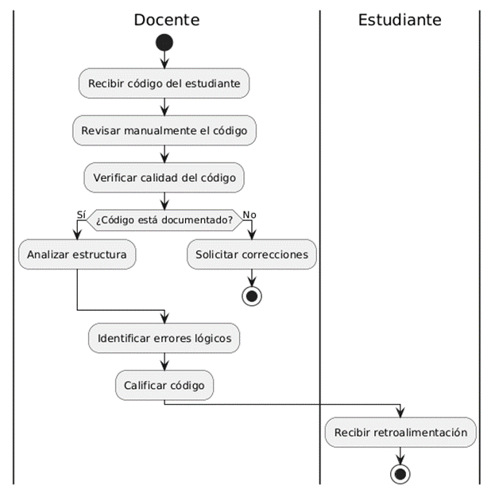

### b) Diagrama del Proceso Propuesto  
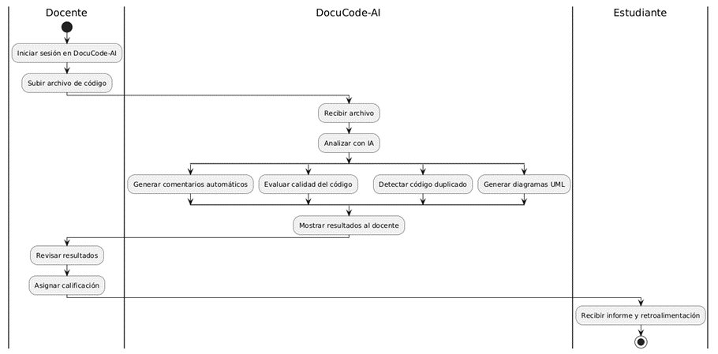

---

# IV. Especificación de Requerimientos de Software

### a) Cuadro de Requerimientos funcionales Inicial

| ID   | Nombre                       | Descripción                                                                 | Prioridad |
|------|------------------------------|-----------------------------------------------------------------------------|-----------|
| RF01 | Registro de usuario          | Registrar nuevos usuarios con correo y contraseña.                           | Alta      |
| RF02 | Inicio de sesión             | Iniciar sesión con credenciales o cuenta de Google.                          | Alta      |
| RF03 | Subida de archivos de código | Subir archivos individuales o comprimidos (.rar/.zip).                        | Alta      |
| RF04 | Generación de comentarios    | Generar comentarios explicativos en el código fuente mediante IA.            | Alta      |
| RF05 | Generación de diagramas UML  | Generar diagramas UML de clases, casos de uso y secuencia automáticamente.    | Alta      |

### b) Cuadro de Requerimientos No funcionales

| ID    | Requerimiento | Descripción                                               | Prioridad |
|-------|---------------|-----------------------------------------------------------|-----------|
| RNF01 | Usabilidad    | La interfaz debe ser intuitiva y amigable.                 | Media     |
| RNF02 | Rendimiento   | El análisis no debe exceder los 10 segundos por archivo.   | Alta      |
| RNF03 | Seguridad     | Encriptar contraseñas y proteger el acceso a los archivos. | Alta      |
| RNF04 | Escalabilidad | Poder crecer para múltiples usuarios simultáneamente.     | Media     |

### c) Cuadro de Requerimientos funcionales Final

| ID   | Nombre                             | Descripción                                                                | Prioridad |
|------|------------------------------------|----------------------------------------------------------------------------|-----------|
| RF01 | Registro de usuario                | Registrar nuevos usuarios con correo y contraseña.                          | Alta      |
| RF02 | Inicio de sesión con Google        | Autenticarse con cuenta de Google.                                          | Alta      |
| RF03 | Subida de archivos .php, .py, .rar | Aceptar código fuente y archivos comprimidos.                               | Alta      |
| RF04 | Generación de comentarios          | Explicaciones línea por línea en el código.                                 | Alta      |
| RF05 | Generación de diagramas UML        | Diagramas de clases, casos de uso, secuencia, actividad, paquetes y componentes. | Alta  |
| RF06 | Evaluación automática de calidad   | Evaluación de calidad basada en métricas estándar.                          | Alta      |
| RF07 | Detección de código duplicado      | Detección de fragmentos repetidos o copiados.                               | Alta      |
| RF08 | Historial de análisis              | Historial de análisis por usuario.                                          | Media     |

### d) Reglas de Negocio

| ID   | Regla de Negocio |
|------|------------------|
| RN01 | Solo usuarios registrados pueden acceder al análisis. |
| RN02 | Tamaño máximo de archivo: 10MB. |
| RN03 | Comentarios generados son explicativos y no reemplazan revisión humana. |
| RN04 | Cada análisis se almacena con fecha, nombre de archivo y resultados. |
| RN05 | No se aceptan archivos ejecutables o que representen riesgos de seguridad. |

---

# V. Fase de Desarrollo

## 1. Perfiles de Usuario

| Perfil              | Descripción |
|---------------------|-------------|
| Administrador       | Acceso completo, gestión de usuarios y resultados. |
| Docente Evaluador   | Analiza código fuente de estudiantes. |
| Estudiante          | Sube código fuente y consulta resultados. |
| Sistema Externo (OpenAI) | Servicio externo que genera comentarios automáticos. |

## 2. Modelo Conceptual

### a) Diagrama de Paquetes  
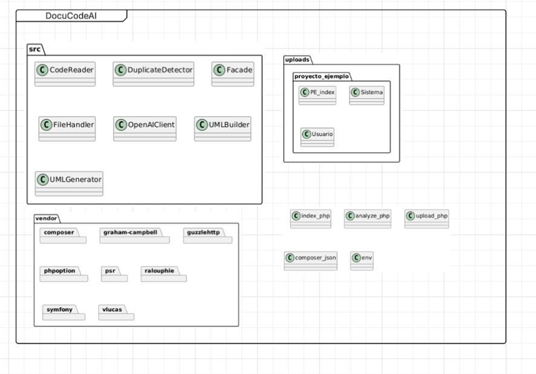

### b) Diagrama de Casos de Uso  
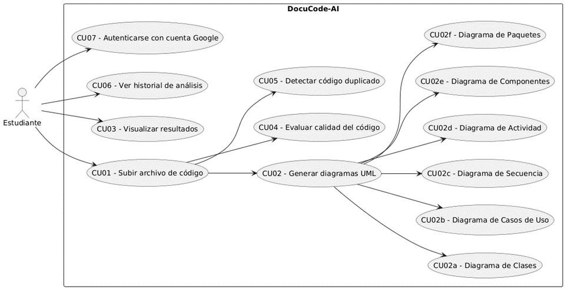

### c) Escenarios de Caso de Uso (narrativa)

---

#### Escenario Detallado – CU01: Subir archivo de código

**Nombre:** Subir archivo de código (Caso de Uso CU01)  
**Actor:** Usuario autenticado (Docente o Estudiante)  
**Descripción:** El usuario carga un archivo de código fuente (.php, .py, .zip) para su posterior análisis y documentación.

| Acción del Usuario | Respuesta del Sistema |
|--------------------|----------------------|
| 1. El usuario accede a la opción "Subir archivo". | 2. El sistema muestra el formulario para seleccionar un archivo. |
| 3. El usuario selecciona un archivo .php o .zip desde su dispositivo. | 4. El sistema valida el tipo de archivo. |
| 5. El usuario hace clic en "Subir". | 6. El sistema guarda el archivo en la carpeta uploads/. |
| 7. El sistema muestra un mensaje de confirmación de subida exitosa. | 8. El sistema habilita las opciones de análisis del archivo subido. |

---

#### Escenario Detallado – CU02: Generar diagramas UML

**Nombre:** Generar diagramas UML (Caso de Uso CU02)  
**Actor:** Usuario autenticado  
**Descripción:** El usuario solicita la generación de los diagramas UML a partir del código cargado previamente.

| Acción del Usuario | Respuesta del Sistema |
|--------------------|----------------------|
| 1. El usuario accede a la opción "Generar diagramas". | 2. El sistema inicia el análisis del archivo previamente cargado. |
| 3. El usuario espera mientras se procesan los archivos. | 4. El sistema identifica los tipos de diagramas a generar (clases, casos de uso, etc.). |
| 5. El sistema genera automáticamente los diagramas UML mediante PlantUML y/o OpenAI. | 6. El sistema muestra los diagramas generados al usuario junto a su código PlantUML. |

---

#### Escenario Detallado – CU03: Visualizar resultados del análisis

**Nombre:** Visualizar resultados del análisis (Caso de Uso CU03)  
**Actor:** Usuario autenticado  
**Descripción:** El usuario visualiza los resultados generados por el sistema, como comentarios de IA, diagramas y duplicaciones.

| Acción del Usuario | Respuesta del Sistema |
|--------------------|----------------------|
| 1. El usuario accede a la sección de resultados. | 2. El sistema carga los resultados generados previamente. |
| 3. El usuario revisa los comentarios del código. | 4. El sistema muestra los comentarios en bloques ordenados. |
| 5. El usuario navega por los distintos diagramas UML. | 6. El sistema presenta cada diagrama con su respectiva imagen y código fuente. |

---

#### Escenario Detallado – CU04: Evaluar calidad del código

**Nombre:** Evaluar calidad del código (Caso de Uso CU04)  
**Actor:** Sistema (proceso automático)  
**Descripción:** El sistema analiza el código y emite una evaluación de calidad basada en buenas prácticas.

| Acción del Usuario | Respuesta del Sistema |
|--------------------|----------------------|
| 1. El usuario sube su archivo de código. | 2. El sistema detecta el archivo e inicia el análisis automático. |
| 3. El sistema analiza estructura, estilo y claridad del código. | 4. El sistema usa IA para evaluar el código y asigna una puntuación. |
| 5. El usuario revisa el informe. | 6. El sistema presenta una evaluación detallada con observaciones. |

---

#### Escenario Detallado – CU05: Detectar código duplicado

**Nombre:** Detectar código duplicado (Caso de Uso CU05)  
**Actor:** Sistema (proceso automático)  
**Descripción:** El sistema identifica fragmentos de código similares o repetidos en uno o más archivos.

| Acción del Usuario | Respuesta del Sistema |
|--------------------|----------------------|
| 1. El usuario sube archivos o un paquete de código. | 2. El sistema extrae el contenido y analiza los bloques. |
| 3. El usuario solicita verificar duplicados. | 4. El sistema compara estructuras y líneas de código. |
| 5. El sistema detecta fragmentos repetidos. | 6. El sistema muestra las coincidencias, archivos involucrados y un resumen. |

---

#### Escenario Detallado – CU06: Ver historial de análisis

**Nombre:** Ver historial de análisis (Caso de Uso CU06)  
**Actor:** Usuario autenticado  
**Descripción:** El usuario puede visualizar el historial de todos los archivos analizados en sesiones anteriores.

| Acción del Usuario | Respuesta del Sistema |
|--------------------|----------------------|
| 1. El usuario accede a su cuenta. | 2. El sistema carga el historial vinculado al usuario. |
| 3. El usuario elige una entrada del historial. | 4. El sistema muestra el análisis asociado (comentarios, diagramas, calidad). |
| 5. El usuario puede exportar o volver a analizar ese archivo. | 6. El sistema ofrece opciones de descarga o reanálisis. |

---

#### Escenario Detallado – CU07: Autenticarse con cuenta Google

**Nombre:** Autenticarse con cuenta Google (Caso de Uso CU07)  
**Actor:** Usuario visitante  
**Descripción:** El usuario inicia sesión mediante su cuenta de Google para acceder al sistema.

| Acción del Usuario | Respuesta del Sistema |
|--------------------|----------------------|
| 1. El usuario hace clic en "Iniciar sesión con Google". | 2. El sistema redirige a la plataforma de autenticación de Google. |
| 3. El usuario otorga permisos. | 4. El sistema recibe los datos de autenticación y verifica el usuario. |
| 5. El usuario es redirigido al sistema. | 6. El sistema muestra el panel principal del usuario. |

---

## 3. Modelo Lógico

### a) Análisis de Objetos  
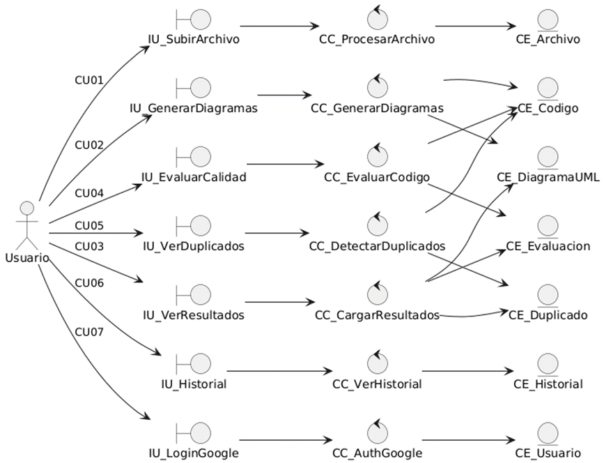

---

### b) Diagrama de Actividades con objetos

**CU01 - Subir archivo de código**  
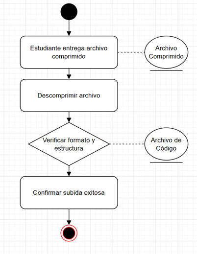

**CU02 - Generar diagramas UML**  
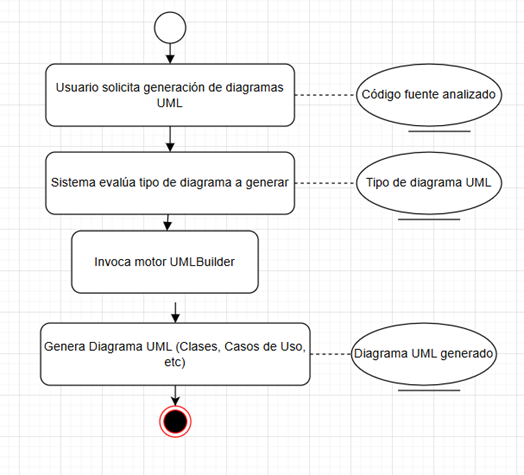

**CU03 - Visualizar resultados**  
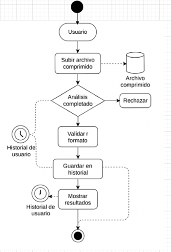

**CU04 - Evaluar calidad del código**  
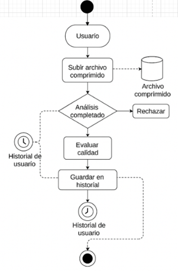

**CU05 - Detectar código duplicado**  
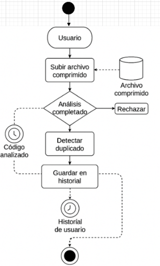

**CU06 - Ver historial de análisis**  
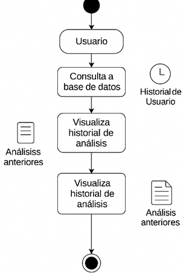

**CU07 - Autenticarse con cuenta Google**  
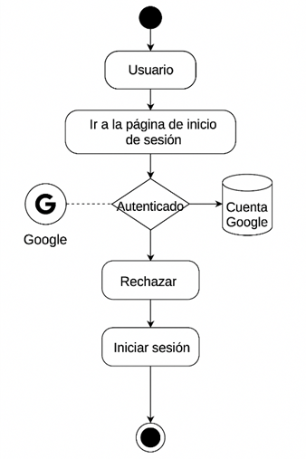

---

### c) Diagrama de Secuencia

**CU01 – Subir archivo de código**  
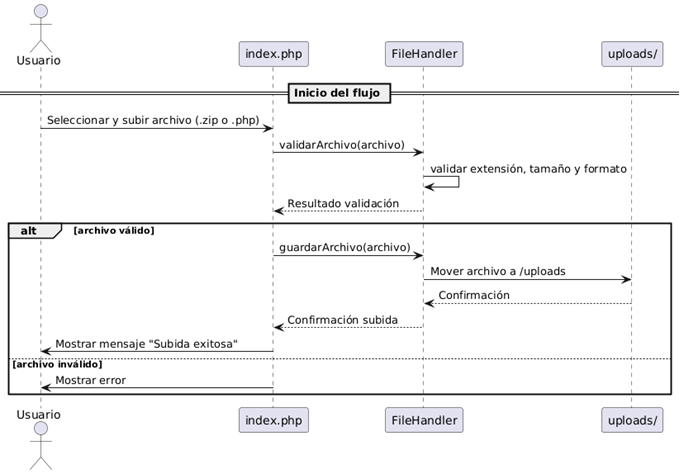

**CU02 – Generar diagramas**  
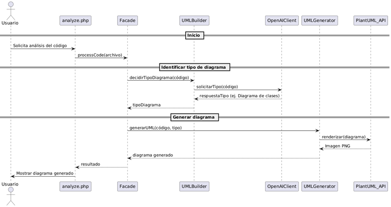

**CU03 – Visualizar resultados**  
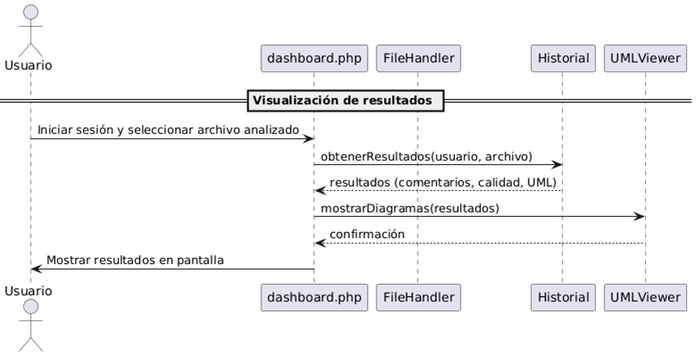

**CU04 – Evaluar calidad del código**  
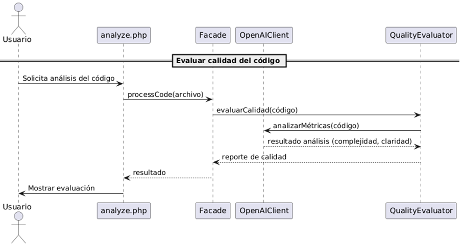

**CU05 – Detectar código duplicado**  
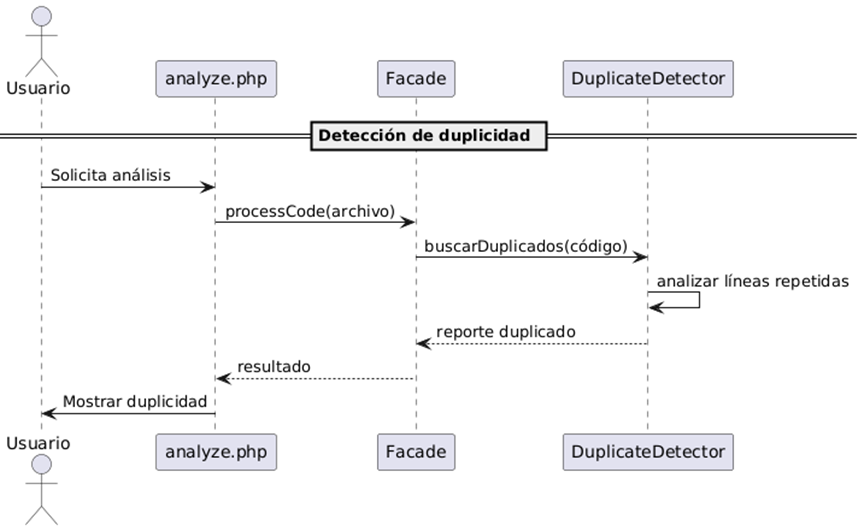

**CU06 – Ver historial de análisis**  
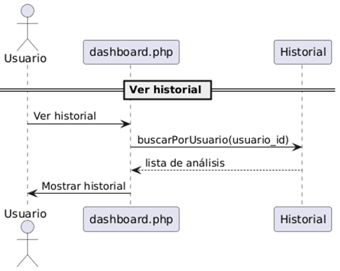

**CU07 – Autenticarse con cuenta Google**  
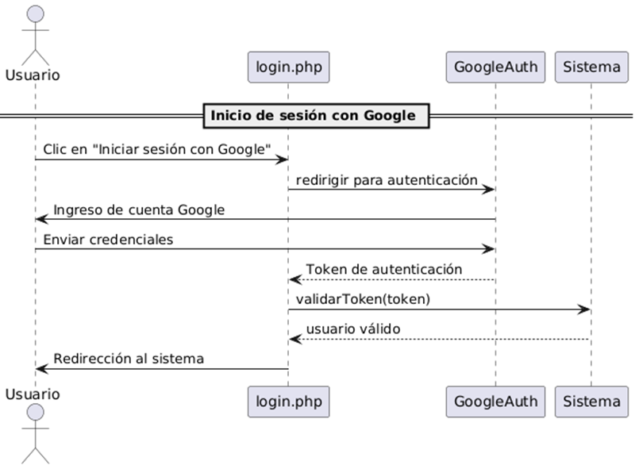

---

### d) Diagrama de Clases

**Diagrama de Clases General del Sistema**  
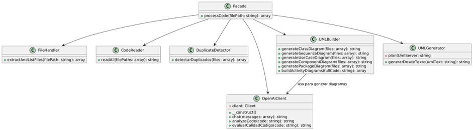

---

# CONCLUSIONES

El desarrollo del sistema DocuCode-AI ha permitido comprobar que es posible automatizar el análisis, documentación y evaluación de código fuente mediante inteligencia artificial, lo cual representa una herramienta innovadora para entornos académicos. La implementación de funcionalidades como la generación automática de diagramas UML, evaluación de calidad del código y detección de duplicados ha demostrado ser eficaz para apoyar a estudiantes y docentes en la comprensión de estructuras y buenas prácticas de programación. Además, la integración de mecanismos de autenticación con Google y una interfaz sencilla mejora la experiencia de usuario, haciendo que el sistema sea accesible y útil para instituciones educativas.

---

# RECOMENDACIONES

- Ampliar la compatibilidad con otros lenguajes como Python, Java o JavaScript.
- Optimizar el análisis semántico con modelos más avanzados como GPT-4 Turbo.
- Habilitar la exportación en Word o LaTeX.
- Explorar integración con plataformas LMS como Moodle.

---

# BIBLIOGRAFIA

- Sommerville, I. (2020). *Software Engineering (10th ed.).* Pearson Education.
- Pressman, R. S., & Maxim, B. R. (2020). *Software Engineering: A Practitioner’s Approach (9th ed.).* McGraw-Hill.
- Gamma, E., et al. (1994). *Design Patterns: Elements of Reusable Object-Oriented Software.* Addison-Wesley.
- Yao, J. T. (2005). *On Web-based Support Systems.* Springer.

---

# WEBGRAFIA

- https://plantuml.com/
- https://platform.openai.com/docs
- https://www.php.net/manual/es/index.php
- https://docs.github.com/
- https://www.w3schools.com/php/

---