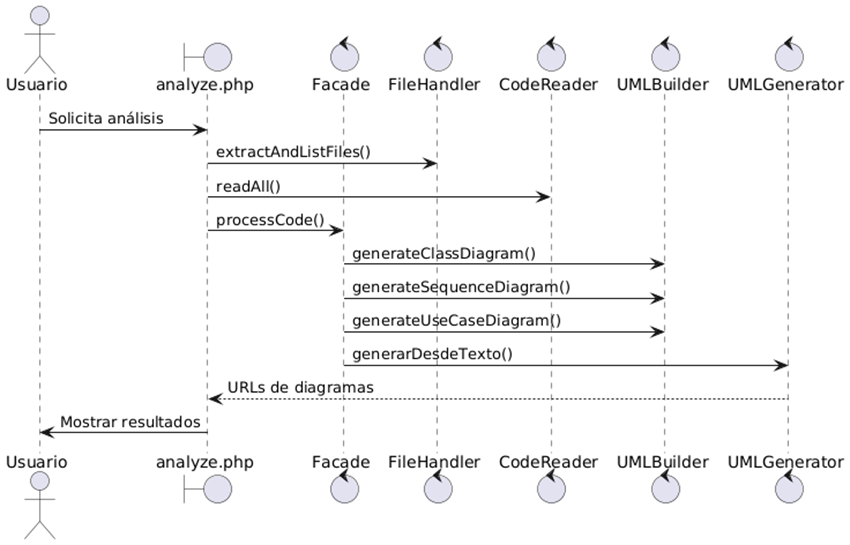

[comment]: 

**UNIVERSIDAD PRIVADA DE TACNA**  
**FACULTAD DE INGENIERIA**  
**Escuela Profesional de Ingeniería de Sistemas**  

**Proyecto DocuCode-AI**  
Curso: *PATRONES DE SOFTWARE*  
Docente: *PATRICK JOSE CUADROS QUIROGA*  

**Integrantes:**  
Jose Luis Jarro Cachi - 2020067148  
Farley Rodrigo Eduardo Viveros Blanco - 2020066896  
Ronal Daniel Lupaca Mamani - 202006146  

**Tacna – Perú**  
**2025**

---

# CONTROL DE VERSIONES

| Versión | Hecha por | Revisada por | Aprobada por | Fecha       | Motivo              |
|---------|-----------|--------------|--------------|-------------|---------------------|
| 1.0     | MPV       | ELV          | ARV          | 3/04/2025   | Versión Original    |
| 2.0     | MPV       | ELV          | ARV          | 30/05/2020  | Mejora              |

---

# Sistema DocuCode-AI  
## Documento de Arquitectura de Software  
**Versión 2.0**

---

# INDICE GENERAL

1. INTRODUCCIÓN
    1.1. Propósito (Diagrama 4+1)
    1.2. Alcance
    1.3. Definición, siglas y abreviaturas
    1.4. Organización del documento
2. OBJETIVOS Y RESTRICCIONES ARQUITECTONICAS
    2.1.1. Requerimientos Funcionales
    2.1.2. Requerimientos No Funcionales – Atributos de Calidad
3. REPRESENTACIÓN DE LA ARQUITECTURA DEL SISTEMA
    3.1. Vista de Caso de uso
        3.1.1. Diagramas de Casos de uso
    3.2. Vista Lógica
        3.2.1. Diagrama de Subsistemas (paquetes)
        3.2.2. Diagrama de Secuencia (vista de diseño)
        3.2.3. Diagrama de Colaboración (vista de diseño)
        3.2.4. Diagrama de Objetos
        3.2.5. Diagrama de Clases
        3.2.6. Diagrama de Base de datos (relacional o no relacional)
    3.3. Vista de Implementación (vista de desarrollo)
        3.3.1. Diagrama de arquitectura software (paquetes)
        3.3.2. Diagrama de arquitectura del sistema (Diagrama de componentes)
    3.4. Vista de procesos
        3.4.1. Diagrama de Procesos del sistema (diagrama de actividad)
    3.5. Vista de Despliegue (vista física)
        3.5.1. Diagrama de despliegue
4. ATRIBUTOS DE CALIDAD DEL SOFTWARE
    Escenario de Funcionalidad
    Escenario de Usabilidad
    Escenario de confiabilidad
    Escenario de rendimiento
    Escenario de mantenibilidad
    Otros Escenarios
---
# 1. INTRODUCCIÓN

## 1.1 Propósito (Diagrama 4+1)

El presente documento tiene como propósito describir la arquitectura del sistema **DocuCode-AI**, un sistema web orientado al análisis y documentación automática de código fuente utilizando Inteligencia Artificial. Esta arquitectura se modela bajo el enfoque del modelo 4+1 de Kruchten, el cual permite representar el sistema desde distintas vistas: lógica, de desarrollo, de procesos, de implementación y de casos de uso, garantizando una comprensión integral por parte de todos los actores involucrados.

Se ha priorizado el cumplimiento de requerimientos funcionales como la generación automática de diagramas UML y la evaluación de código, así como atributos de calidad como usabilidad, rendimiento y mantenibilidad. Asimismo, se ha dado preferencia a la eficiencia y facilidad de mantenimiento, sin descuidar la portabilidad del sistema.

## 1.2 Alcance

El presente documento se enfoca principalmente en el desarrollo de la vista lógica de la arquitectura del sistema DocuCode-AI. Esta vista contempla los elementos esenciales que permiten comprender la estructura interna del sistema, tales como los paquetes, clases, secuencias de interacción y componentes clave. Asimismo, se incluyen representaciones relevantes de las demás vistas arquitectónicas (casos de uso, implementación, despliegue y atributos de calidad) con el objetivo de ofrecer una comprensión integral del diseño.

No obstante, se omiten detalles que no aportan valor significativo al análisis del sistema en su contexto actual, como aquellos relacionados con la vista de procesos pesados o concurrencia a nivel de hilos. El documento busca brindar una visión clara, estructurada y suficiente para guiar las etapas de desarrollo, implementación y mantenimiento del sistema.

## 1.3 Definición, siglas y abreviaturas

| Término / Sigla | Definición |
|-----------------|------------|
| API | Interfaz de Programación de Aplicaciones |
| Caso de Uso | Técnica para describir las funcionalidades del sistema desde el punto de vista del usuario |
| CLP | Peso Chileno |
| Diagrama de Clase | Representación gráfica de clases, atributos y relaciones |
| Diagrama de Paquetes | Organización de módulos/carpetas lógicas |
| DocuCode-AI | Sistema basado en IA para análisis y documentación de código |
| MVC | Modelo-Vista-Controlador |
| OpenAI | Plataforma de IA usada para generar descripciones sobre el código |
| PlantUML | Herramienta para generar diagramas UML |
| UML | Lenguaje Unificado de Modelado |
| Usuario | Persona que interactúa con el sistema |
| ZIP | Formato de archivo comprimido |

## 1.4 Organización del documento

Este documento está organizado de la siguiente manera:

- **Capítulo 1**: Introducción y contexto del sistema.
- **Capítulo 2**: Objetivos arquitectónicos y restricciones.
- **Capítulo 3**: Representación de la arquitectura del sistema en sus diversas vistas (4+1).
- **Capítulo 4**: Atributos de calidad del software.

---

# 2. OBJETIVOS Y RESTRICCIONES ARQUITECTÓNICAS

Esta sección define los objetivos arquitectónicos esenciales y las restricciones que condicionan el diseño del sistema **DocuCode-AI**. Asimismo, se priorizan los requerimientos funcionales y no funcionales con el fin de guiar la implementación progresiva del sistema.

## 2.1 Priorización de requerimientos

A continuación, se presentan los requerimientos funcionales y no funcionales ordenados por prioridad, lo cual permite establecer una hoja de ruta para su implementación y evaluación en fases futuras.

### 2.1.1 Requerimientos Funcionales

| ID | Descripción | Prioridad |
|----|-------------|-----------|
| RF01 | Permitir la carga de archivos individuales o comprimidos (ZIP, RAR) | Alta |
| RF02 | Analizar el contenido del código fuente y extraer información estructural | Alta |
| RF03 | Generar automáticamente diagramas UML: clases, secuencia, casos de uso | Alta |
| RF04 | Generar diagramas UML adicionales: actividades, componentes, paquetes | Media |
| RF05 | Evaluar la calidad del código fuente analizado | Media |
| RF06 | Detectar código duplicado en los archivos analizados | Media |
| RF07 | Guardar historial de análisis por usuario autenticado | Alta |
| RF08 | Permitir visualización detallada de resultados con exportación PDF | Media |

### 2.1.2 Requerimientos No Funcionales – Atributos de Calidad

| ID | Descripción | Prioridad |
|----|-------------|-----------|
| RNF01 | Disponibilidad >= 99% en horarios hábiles | Alta |
| RNF02 | Procesar archivos de hasta 20MB en < 10 segundos | Alta |
| RNF03 | Interfaz web amigable y responsiva (compatible con móviles) | Alta |
| RNF04 | Diseño que permita mantenimiento y extensión | Media |
| RNF05 | Comunicación frontend/backend protegida con HTTPS | Alta |
| RNF06 | Resultados privados y accesibles solo por el usuario autenticado | Alta |
| RNF07 | Posibilidad de integrar nuevas APIs en el futuro | Media |

## 2.2 Restricciones

A continuación, se describen las principales restricciones técnicas, operativas y de desarrollo que condicionan el diseño y funcionamiento del sistema **DocuCode-AI**:

- **Restricción Tecnológica**: PHP en backend, compatible con servidores Apache/Nginx y localmente en XAMPP.  
- **Restricción de Plataforma**: Navegadores modernos (Chrome, Firefox, Edge), diseño responsive.  
- **Restricción de Terceros (API)**: Uso de OpenAI API condicionado a límite de tokens, disponibilidad y credenciales del usuario.  
- **Restricción de Tamaño de Archivos**: Hasta 20MB.  
- **Restricción de Seguridad**: Comunicación vía HTTPS.  
- **Restricción de Almacenamiento**: Conservación de resultados por un máximo de 30 días.  
- **Restricción Académica**: Cumplir con cronograma y criterios de la asignatura *Patrones de Software*.

---
# 3. REPRESENTACIÓN DE LA ARQUITECTURA DEL SISTEMA

## 3.1 Vista de Caso de uso

La vista de caso de uso permite comprender las funcionalidades principales del sistema **DocuCode-AI** desde la perspectiva de los actores que interactúan con él. Esta vista es esencial para validar que el sistema satisface los requisitos funcionales esperados por los usuarios finales y otros interesados.

El sistema contempla los siguientes actores principales:

- **Usuario autenticado**: Persona que accede al sistema mediante inicio de sesión, y puede cargar archivos, visualizar análisis y ver su historial.
- **Sistema OpenAI (externo)**: Servicio de inteligencia artificial al que se consulta para generar resúmenes, comentarios y sugerencias de calidad.
- **Administrador (opcional)**: Responsable de gestionar accesos o auditorías futuras.

### 3.1.1 Diagramas de Casos de uso

| ID | Nombre del Caso de Uso | Descripción resumida |
|----|-----------------------|---------------------|
| CU01 | Subir archivo | El usuario carga un archivo individual o comprimido para ser analizado. |
| CU02 | Generar diagramas UML | El sistema analiza el código y genera diagramas UML automáticamente. |
| CU03 | Visualizar resultados | El usuario revisa los diagramas y comentarios generados. |
| CU04 | Evaluar calidad del código | Se muestran sugerencias basadas en principios de buenas prácticas. |
| CU05 | Detectar código duplicado | El sistema detecta y reporta duplicaciones entre archivos. |
| CU06 | Ver historial de análisis | El usuario accede a sus análisis anteriores. |
| CU07 | Autenticarse con cuenta de Google | Permite acceso seguro mediante OAuth 2.0 de Google. |

#### Diagrama casos de uso

---

## 3.2 Vista Lógica

La vista lógica representa la estructura del sistema **DocuCode-AI** desde una perspectiva funcional, orientada a mostrar cómo se organizan sus componentes internos y cómo se relacionan entre sí. Esta vista es clave para comprender la arquitectura de software a nivel de diseño, destacando los subsistemas, módulos o paquetes que permiten la implementación modular, mantenible y escalable.

En **DocuCode-AI**, el sistema se ha diseñado siguiendo el patrón *Facade*, permitiendo desacoplar la interfaz de usuario del procesamiento interno. A su vez, se adopta una descomposición en capas funcionales, que separan la lógica de presentación, lógica de negocio y servicios externos.

### 3.2.1 Diagrama de Subsistemas (paquetes)

### 3.2.2 Diagrama de Secuencia (vista de diseño)

#### CU01 – Subir archivo  

#### CU02 – Generar Diagramas UML  

#### CU03 – Visualizar resultados  

#### CU04 – Evaluar calidad del código  

#### CU05 – Detectar código duplicado  

#### CU06 – Ver Historial de análisis  

#### CU07 – Autenticarse con Google (OAuth)  

### 3.2.3 Diagrama de Objetos

### 3.2.4 Diagrama de Clases

### 3.2.5 Diagrama de Base de datos (relacional o no relacional)

---

## 3.3 Vista de Implementación (vista de desarrollo)

### 3.3.1 Diagrama de arquitectura software (paquetes)

### 3.3.2 Diagrama de arquitectura del sistema (Diagrama de componentes)

---

## 3.4 Vista de procesos

### 3.4.1 Diagrama de Procesos del sistema (diagrama de actividad)

---

## 3.5 Vista de Despliegue (vista física)

### 3.5.1 Diagrama de despliegue

---
# 4. ATRIBUTOS DE CALIDAD DEL SOFTWARE

Los atributos de calidad (Quality Attributes, QAs) representan propiedades medibles y evaluables de un sistema que permiten identificar el grado en que este satisface las necesidades de sus usuarios y partes interesadas (stakeholders), más allá de su funcionalidad básica. Según Wojcik (2013), estos atributos corresponden a los requerimientos no funcionales y son fundamentales para determinar la aceptación, confiabilidad y sostenibilidad del software.

En el caso del sistema **DocuCode-AI**, los atributos de calidad permiten asegurar que el entorno académico pueda confiar en un sistema estable, seguro, comprensible y eficiente, facilitando la experiencia tanto del estudiante como del docente en el análisis de código y generación de documentación técnica automatizada.

A continuación, se detallan los principales atributos evaluados:

## Escenario de Funcionalidad

**DocuCode-AI** ha sido diseñado para ofrecer una cobertura completa de funcionalidades requeridas en el entorno educativo. Entre estas destacan:

- Subida de archivos.
- Análisis automatizado con IA.
- Generación de diagramas UML.
- Evaluación de calidad de código.

La seguridad general del sistema se garantiza mediante validación de archivos y delimitación de roles en el acceso a funcionalidades. Su arquitectura modular permite una clara separación de responsabilidades.

## Escenario de Usabilidad

El sistema presenta una interfaz intuitiva basada en diseño web moderno, que facilita el aprendizaje y uso por parte de estudiantes y docentes. Las funciones están claramente etiquetadas y agrupadas en pasos secuenciales que guían al usuario en el proceso de análisis.

Asimismo, los resultados generados (gráficos, texto analizado y enlaces a diagramas) están organizados en bloques visibles, permitiendo una interpretación clara de la información.

## Escenario de confiabilidad

La confiabilidad del sistema se asegura mediante:

- Controles internos en la carga de archivos.
- Gestión de excepciones.
- Trazabilidad del historial de análisis.

El sistema incluye mecanismos de validación estructural del código, previene el procesamiento de archivos corruptos o maliciosos y mantiene la integridad de la información durante el ciclo de uso.

También se contempla la recuperación ante errores como parte del diseño robusto.

## Escenario de rendimiento

El rendimiento del sistema se mide en función del tiempo de respuesta al analizar archivos y generar diagramas. Para ello, se optimiza el procesamiento mediante:

- Cargas asíncronas.
- Uso de compresión en la transmisión de datos.

Las pruebas preliminares demuestran tiempos de respuesta aceptables (< 4 segundos para archivos estándar) y un consumo moderado de recursos del servidor. Las llamadas a la API de OpenAI se manejan de forma eficiente para evitar cuellos de botella.

## Escenario de mantenibilidad

Se ha considerado el rendimiento proyectado del sistema en condiciones de uso continuo por parte de varios usuarios simultáneamente.

El atributo **Performance** permite anticipar la capacidad del sistema para soportar múltiples análisis en paralelo, gracias al uso de arquitectura web escalable y balanceada.

También se evalúa su capacidad para procesar grandes volúmenes de código en un tiempo aceptable sin deterioro significativo de la experiencia del usuario.

---

