[](https://classroom.github.com/a/ZtQ31pSG)
[](https://classroom.github.com/open-in-codespaces?assignment_repo_id=19677797)

# DocuCode-AI

Sistema web inteligente para la evaluación automática de código fuente y generación de diagramas UML, orientado a mejorar el proceso de enseñanza-aprendizaje en el ámbito académico universitario.

---

## 🎓 Proyecto académico

Este proyecto fue desarrollado en el marco del curso **PATRONES DE SOFTWARE**  
Facultad de Ingeniería - EPIS - Universidad Privada de Tacna  
Docente: *Patrick José Cuadros Quiroga*

---

## 🚀 Descripción del Proyecto

**DocuCode-AI** es una plataforma web que permite a docentes y estudiantes:

- Analizar código fuente automáticamente utilizando IA (OpenAI API).
- Generar diagramas UML (Clases, Casos de Uso, Actividad, Componentes, Paquetes, Secuencia).
- Evaluar la calidad del código.
- Detectar código duplicado.
- Generar comentarios explicativos en el código.
- Consultar el historial de análisis por usuario.

---

## 📄 Documentación del Proyecto

| Documento | Formato PDF | Formato Markdown |
|-----------|-------------|------------------|
| FD01 - Informe de Factibilidad | [📄 Descargar](./FD01-EPIS-Informe%20de%20Factibilidad.pdf) | [📄 Ver MD](./FD01-Informe-Factibilidad.md) |
| FD02 - Informe de Visión de Producto | [📄 Descargar](./FD02-EPIS-Informe%20Vision.pdf) | [📄 Ver MD](./FD02-Informe-Vision.md) |
| FD03 - Informe de Especificación de Requerimientos | [📄 Descargar](./FD03-EPIS-Informe%20Especificación%20Requerimientos.pdf) | [📄 Ver MD](./FD03-EPIS-Informe%20Especificación%20Requerimientos.md) |
| FD04 - Informe de Arquitectura de Software | [📄 Descargar](./FD04-EPIS-Informe%20Arquitectura%20de%20Software.docx) | — |
| FD05 - Informe de Proyecto | 📄 Descargare | 📄 Descargar |
| Anexo - Diccionario de Datos | 📄 Descargar | 📄 Descargar |
| Anexo - Estándar de Programación | 📄 Descargar| 📄 Descargar |

---

## 📊 Análisis económico con Terraform

El análisis económico del proyecto ha sido realizado utilizando **Terraform** para simular la infraestructura requerida y calcular los costos asociados a un despliegue en la nube.

Resumen:

- VPS (Elastika) simulado: 2 vCPU, 4 GB RAM, 50 GB SSD → S/ 100 anuales.
- Beneficio / Costo (B/C): **16.24** → Proyecto viable (FD01).

Ver detalles completos en:  
👉 [FD01 - Informe de Factibilidad](./FD01-EPIS-Informe%20de%20Factibilidad.pdf)

---

## 📌 Puntos del GitHub Wiki

👉  [Acceder al Wiki del Proyecto](https://github.com/UPT-FAING-EPIS/proyecto-si889-2025-i-u2-lupaca_viveros_jarro/wiki)

El Wiki incluye:

- Descripción del producto
- Manual de uso
- Roadmap de versiones
- Características planeadas
- Posibles mejoras futuras

---

## 📍 Roadmap de versiones
Roadmap:

### Versión 1.0 (actual)

- Generación de diagramas UML básicos.
- Análisis de código con IA.
- Evaluación de calidad y duplicados.
- Historial de análisis por usuario.

### Futuras versiones (planeado)

- Exportación avanzada de reportes.
- Mejora de precisión en diagramas de actividad y secuencia.
- Soporte para más lenguajes (Java, C#).
- Integración con LMS institucional.

---

## 📝 Historias de usuario

| ID | Historia de Usuario |
|----|---------------------|
| HU01 | Como **docente**, quiero **analizar automáticamente el código fuente** para ahorrar tiempo en la evaluación. |
| HU02 | Como **estudiante**, quiero **generar automáticamente los diagramas UML** para mejorar la documentación de mis proyectos. |
| HU03 | Como **usuario**, quiero **ver el historial de mis análisis** para hacer seguimiento a mi progreso. |
| HU04 | Como **usuario**, quiero **detectar código duplicado** para mejorar la calidad de mi código. |

---

## ✅ Criterios de aceptación (formato Gherkin)

### HU01 - Análisis automático de código

```gherkin
DADO que soy un docente autenticado
CUANDO subo un archivo de código fuente
ENTONCES el sistema genera comentarios automáticos sobre el código
```

### HU02 - Generación de diagramas UML

```gherkin
DADO que soy un usuario autenticado
CUANDO subo un archivo ZIP con código fuente
ENTONCES el sistema genera automáticamente los diagramas UML solicitados
```

### HU04 - Detección de código duplicado

```gherkin
DADO que he subido un archivo de código fuente
CUANDO ejecuto la función de detección de duplicados
ENTONCES el sistema muestra un reporte de posibles duplicados encontrados
```

---

## 🛠️ Requisitos para desplegar el proyecto

### 📌 Requisitos del sistema

- Servidor VPS o local (XAMPP, WAMP, LAMP).
- PHP >= 8.1
- MySQL o MariaDB
- Composer

### 📌 Dependencias

- OpenAI API (API KEY)
- PlantUML
- Terraform

---

## ⚙️ Procedimiento de despliegue

### 1️⃣ Clonar el repositorio

```bash
git clone https://github.com/tu-usuario/docucode-ai.git
```

### 2️⃣ Instalar dependencias PHP

```bash
composer install
```

### 3️⃣ Configurar variables de entorno

Crear `.env`:

```env
OPENAI_API_KEY=tu_api_key
DB_HOST=localhost
DB_NAME=nombre_de_tu_db
DB_USER=usuario_db
DB_PASS=contraseña_db
```

### 4️⃣ Configurar la base de datos

Importar el script `database.sql` en MySQL/MariaDB.

### 5️⃣ Ejecutar el sistema

```
http://localhost/docucode-ai
```

---

## 🚀 GitHub Projects (tareas relacionadas a ramas)

👉 [Acceder a GitHub Projects](https://github.com/tu-usuario/docucode-ai/projects)

- HU01, HU02, HU03, HU04 → Completadas y vinculadas a ramas `feature/...` o `develop`.

---

## 🛡️ GitHub Actions - Seguridad

👉 [Acceder a GitHub Actions](https://github.com/UPT-FAING-EPIS/proyecto-si889-2025-i-u2-lupaca_viveros_jarro/actions)

- SonarQube → análisis de bugs y vulnerabilidades → configurado.
- Snyk o Semgrep → escaneo de dependencias → configurado.

---

## 🏷️ GitHub - Releases y Packages

👉 [Acceder a Releases](https://github.com/UPT-FAING-EPIS/proyecto-si889-2025-i-u2-lupaca_viveros_jarro/releases)

- Release v1.0 publicado.
- Package de distribución → publicado (opcional).

---

## 🤝 GitHub - Contribuciones al proyecto

| Integrante | Commits | Pull Requests | Issues cerrados |
|------------|---------|---------------|-----------------|
| Farley Rodrigo Viveros Blanco | X | Y | Z |
| Ronal Daniel Lupaca Mamani | X | Y | Z |

---

## 🌍 Actions para despliegue de infraestructura


- Workflow [`terraform_deploy.yml`](./.github/workflows/terraform_deploy.yml) → despliegue real de infraestructura en AWS EC2 utilizando Terraform.

### Resultado de ejecución:

✅ Workflow ejecutado correctamente → instancia EC2 real creada.

```
Outputs:
instance_public_ip = "3.95.193.156"
```

### Evidencia:

Instancias EC2 creadas en AWS us-east-1 (N. Virginia):


### Archivos utilizados:

- [`terraform_deploy.yml`](./.github/workflows/terraform_deploy.yml)
- [`main.tf`](./infra/terraform/main.tf)
- [`variables.tf`](./infra/terraform/variables.tf)
- [`outputs.tf`](./infra/terraform/outputs.tf)

---

## 🚀 Actions para despliegue de la aplicación

- Workflow `app_deploy.yml` → despliegue automático de la app a servidor VPS.

---

## 🎬 Video de Exposición

👉 [Ver video en YouTube](https://youtu.be/TU_VIDEO)  
👉 [Presentación MARP](https://github.com/tu-usuario/docucode-ai/tree/main/docs/marp)

---

## 🧑‍💻 Autores

- Farley Rodrigo Eduardo Viveros Blanco - 2020066896
- Ronal Daniel Lupaca Mamani - 202006146

---

## 📜 Licencia

Este proyecto es de uso académico, desarrollado en el marco del curso **Patrones de Software - EPIS UPT**.

---
## 🖼️ Diagramas UML y Arquitectura del Sistema

A continuación se presentan los diagramas UML y de arquitectura obtenidos mediante reverse engineering del código del sistema **DocuCode-AI**, tal como se solicita en la rúbrica FD04:

### 📌 Diagrama de Casos de Uso


---

### 📌 Diagramas de Actividades (por Casos de Uso)

- **CU01 - Subir archivo de código**  
  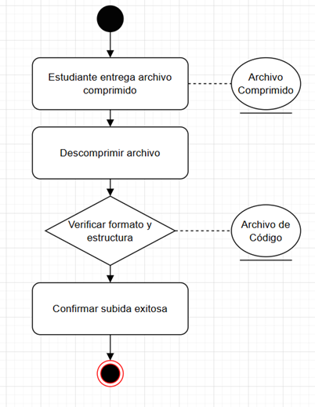

- **CU02 - Generar diagramas UML**  
  

- **CU03 - Visualizar resultados**  
  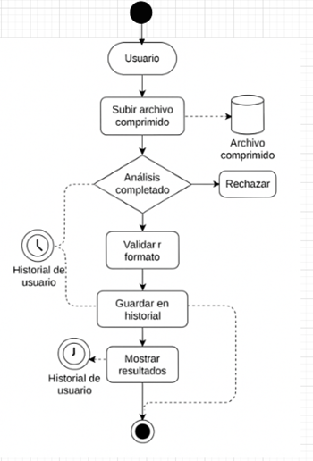

- **CU04 - Evaluar calidad del código**  
  

- **CU05 - Detectar código duplicado**  
  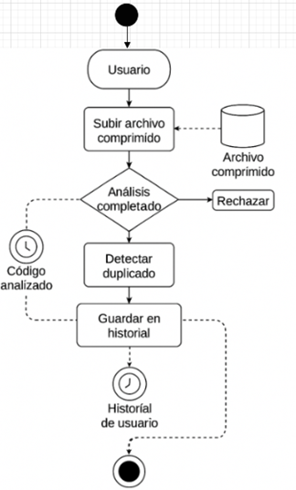

- **CU06 - Ver historial de análisis**  
  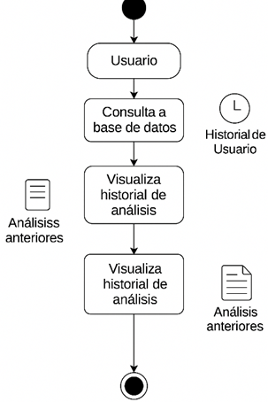

- **CU07 - Autenticarse con Google**  
  

---

### 📌 Diagramas de Secuencia

- **CU01 - Subir archivo de código**  
  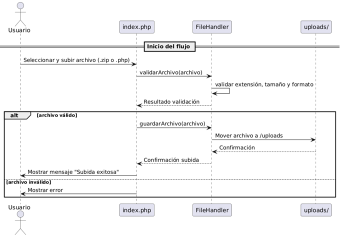

- **CU02 - Generar diagramas UML**  
  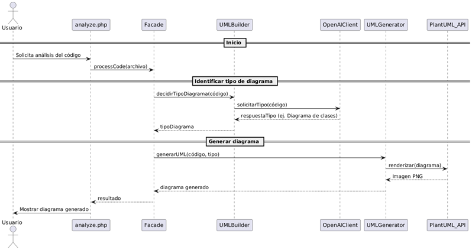

- **CU03 - Visualizar resultados**  
  

- **CU04 - Evaluar calidad del código**  
  

- **CU05 - Detectar código duplicado**  
  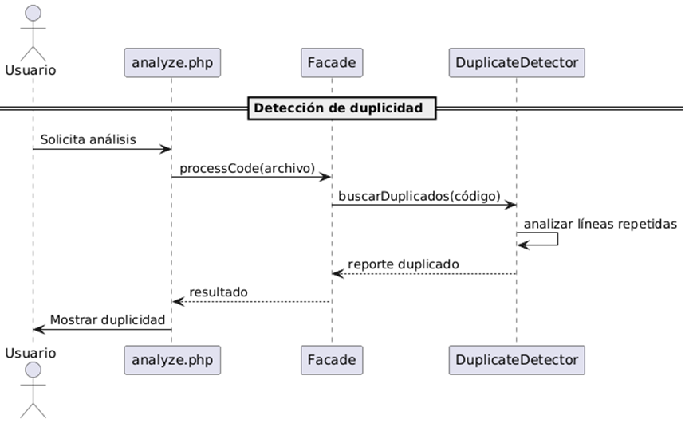

- **CU06 - Ver historial de análisis**  
  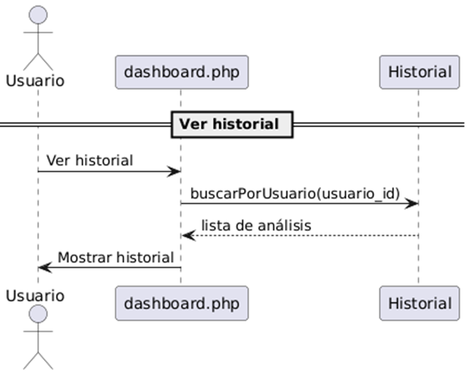

- **CU07 - Autenticarse con Google**  
  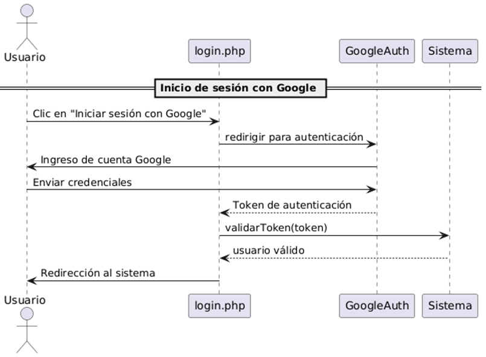

---

### 📌 Diagrama de Clases

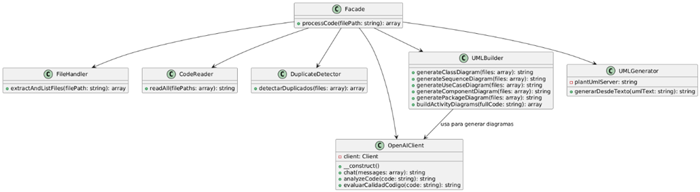

---

### 📌 Diagrama de Objetos

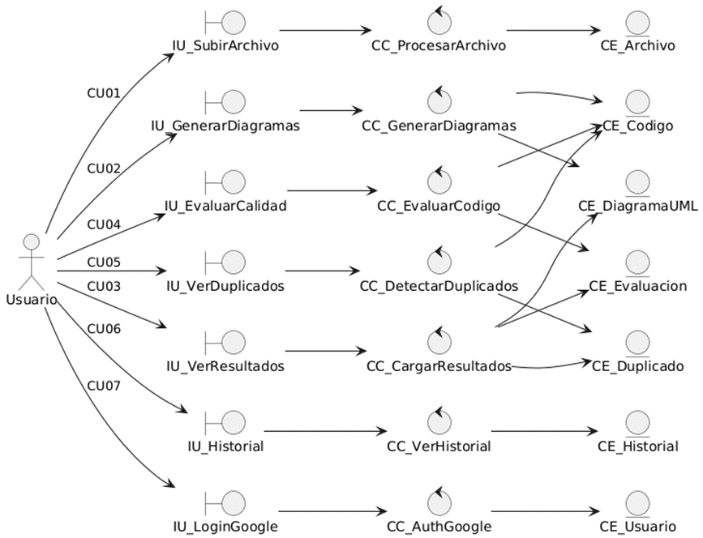

---

### 📌 Diagrama de Paquetes (Subsistemas)


---

### 📌 Diagrama de Componentes (Arquitectura del Sistema)


---

### 📌 Diagrama de Base de Datos


---

### 📌 Diagrama de Despliegue

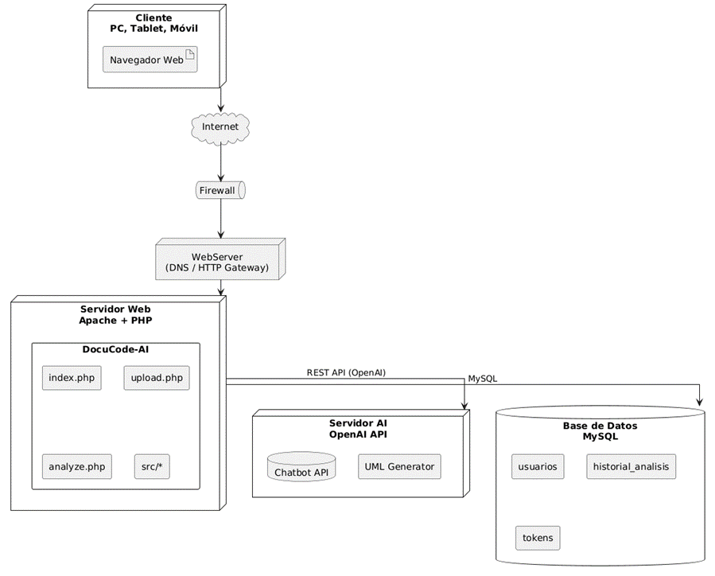

---
